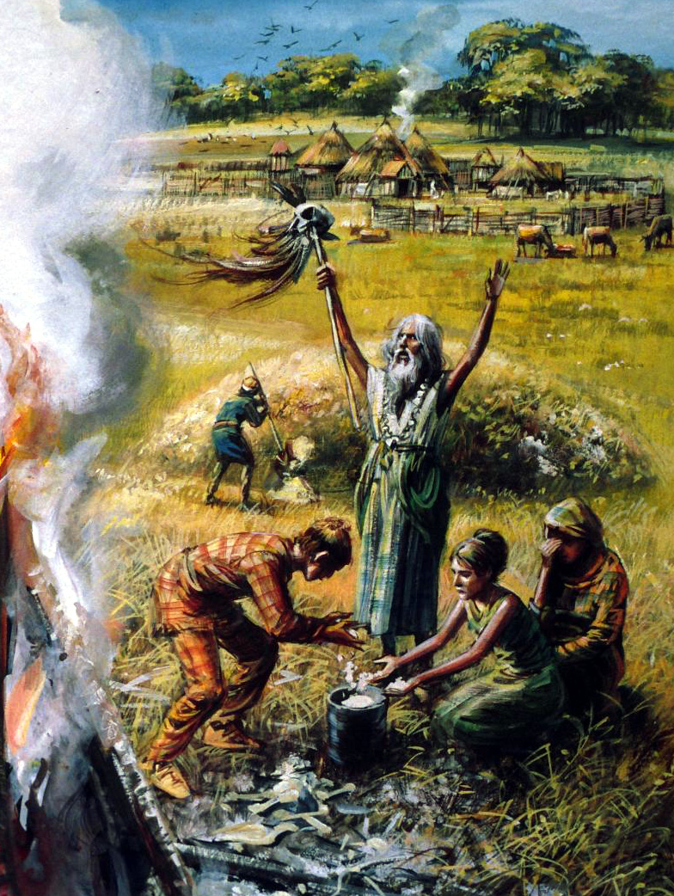

```{r setup, include=FALSE}
knitr::opts_chunk$set(echo = FALSE)
```

## Konzeptpräsentation 

<div id="left">
  <font size="10">**Bronzezeit, Bestattungen & Cultural Evolution**</font>

  Clemens Schmid \
  *22. Februar 2018*
</div>

<div id="right">
  <figure>
    
    <figcaption>© Mike Codd, hampshirearchaeology.wordpress.com [13.02.18]</figcaption>
  </figure>
</div>

## 

```{r}
system("R -e 'shiny_neiman_1.R'")
```

<iframe src="http://127.0.0.1:3539" style="width: 8000px; height: 900px"></iframe>


