```{r setup, include=FALSE}
knitr::opts_chunk$set(echo = FALSE)
```

## Presentation Bronze Age Round Table 

<font size="6">**A computational Cultural Transmission model of Bronze Age burial rites in Central, Northern and North-western Europe**</font>

Clemens Schmid -- 05. Juni 2018

<figure>
  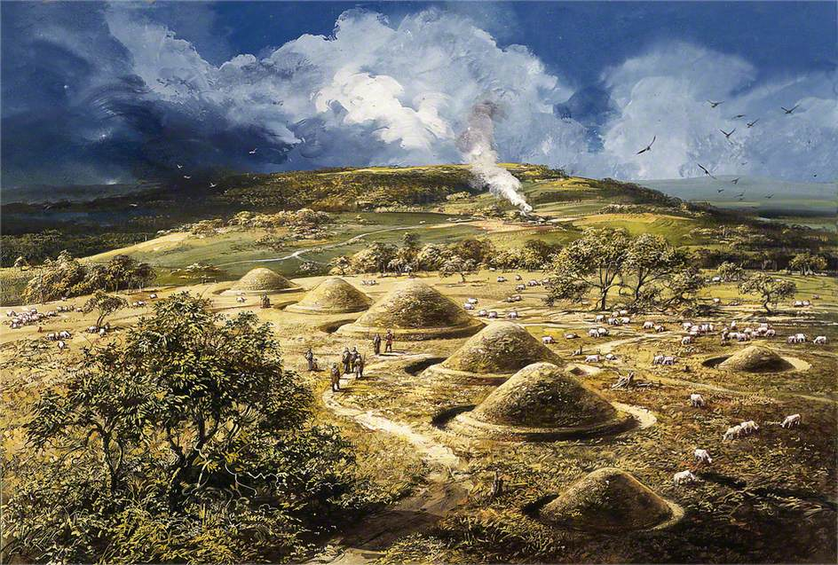
  <figcaption>© Michael Codd -- Devil's Jumps, Treyford, West Sussex, Barrow Cemetery -- West Sussex County Council, www.artuk.org [03.06.18]</figcaption>
</figure>

## Presentation Bronze Age Round Table 

<font size="6">**A computational Cultural Transmission model of Bronze Age burial rites in Central, Northern and North-western Europe**</font>

Clemens Schmid -- 05. Juni 2018

\

- **Context: Burial rites in Central Europe**
- **Data**
  - Overview: Radon-B
  - The case of Southwestern Germany (Falkenstein 2017)
- **Theory**
  - Cultural Evolution
  - Transmission of neutral variants (Dunnell 1978 + Neiman 1995)
- **Model & Simulation**
  - Population generation
  - Expansion Algorithm
  - First simultation runs

⚠ work in progress ⚠

## 

\
\
\

<font size="20">**Context**</font>

<hr>

## Burial customs of the European Bronze Age

- Graves and cemeteries are an essential category of Bronze Age research

\

<div class="fragment" data-fragment-index="2">
- spatial and temporal **heterogeneity of phenomena**
     - Grave position and association (subsequent use of Neolithic megalithics, cemeteries, etc.) 
     - Grave construction (coffins, houses of the dead, boat graves, etc.)
     - Selection of burial objects 
     - Placement of the corpse
     - ...
</div>

\

<div class="fragment" data-fragment-index="3">
- **Main dimensions**
    - Inhumation vs. Cremation
    - Flat grave vs. Burial mound
</div>
    
## Classical narrative of the development of Bronze Age burial customs

<div class="fragment" data-fragment-index="1">
**Early and Middle Bronze Age**

- Inhumations (in different variations)
- Cremation graves initially dominate only in the Hungarian Plain
</div>
<div class="fragment" data-fragment-index="2">
- Burial mounds in Eastern, Western and Northern Europe
- Flat graves in Central and Southern Europe, mounds are slowly gaining importance 
</div>

\

<div class="fragment" data-fragment-index="3">
**Late Bronze Age**

- cremation is (almost) everywhere: Urnfield Period
</div>

## 

\
\
\

<font size="20">**Data**</font>

<hr>

## Quantitative recording of phenomena: RADON-B

<figure>
  
</figure>

<div class="fragment" data-fragment-index="1">
<sup>14</sup>C dates with context information

- **2336** Dates from graves between 2200 and 800 calBC
- Metainformation
     - **1465** dates from this with an entry for the dimension     
       Inhumation/Cremation (935/530)
     - **915** dates from this with an entry for the dimension    
       Flat grave/Burial mound (459/456)
     - **753** dates with specifications for both contexts
</div>

## RADON-B date distribution

<figure>
  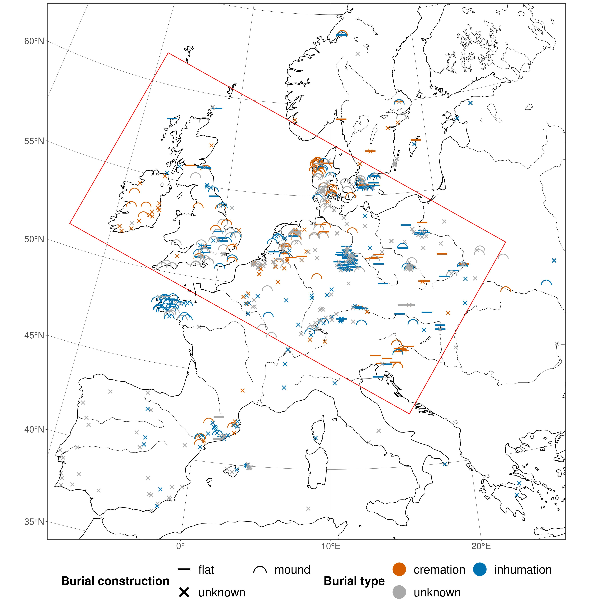
  <figcaption>All ^14^C-dates from graves 2200-800calBC</figcaption>
</figure>

## Research area 

<figure>
  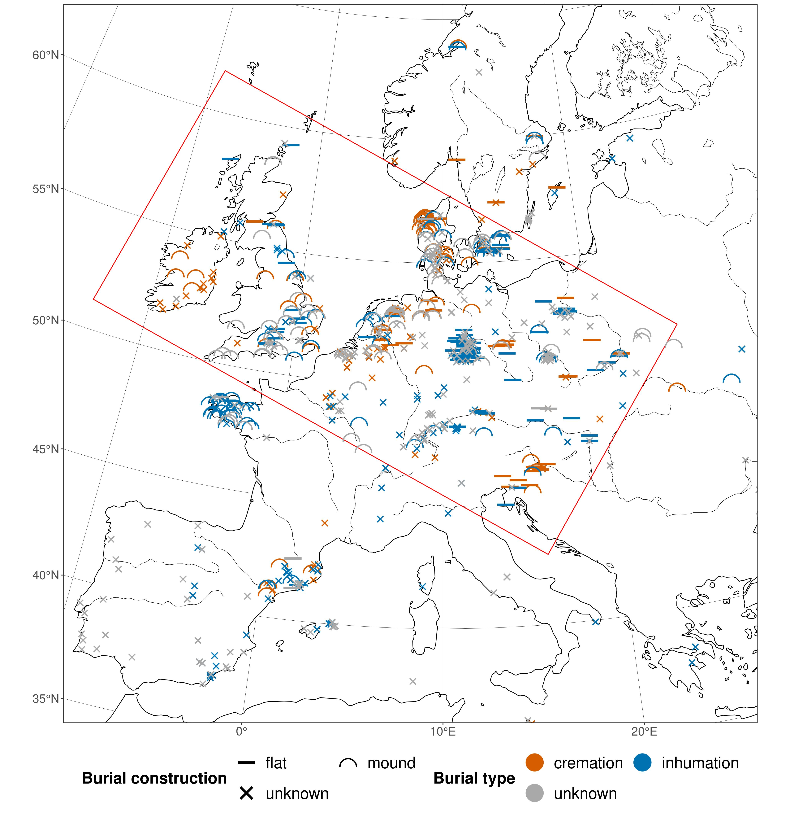
  <figcaption>Artifical research area (rectangular form in Europe Albers Equal Area Conic EPSG: 102013) </figcaption>
</figure>

##

<section data-background-video="figures/the_movie_4.mp4" data-background-color="#f1f1f1"> 
</section>

## Diachronic perspective

<figure>
  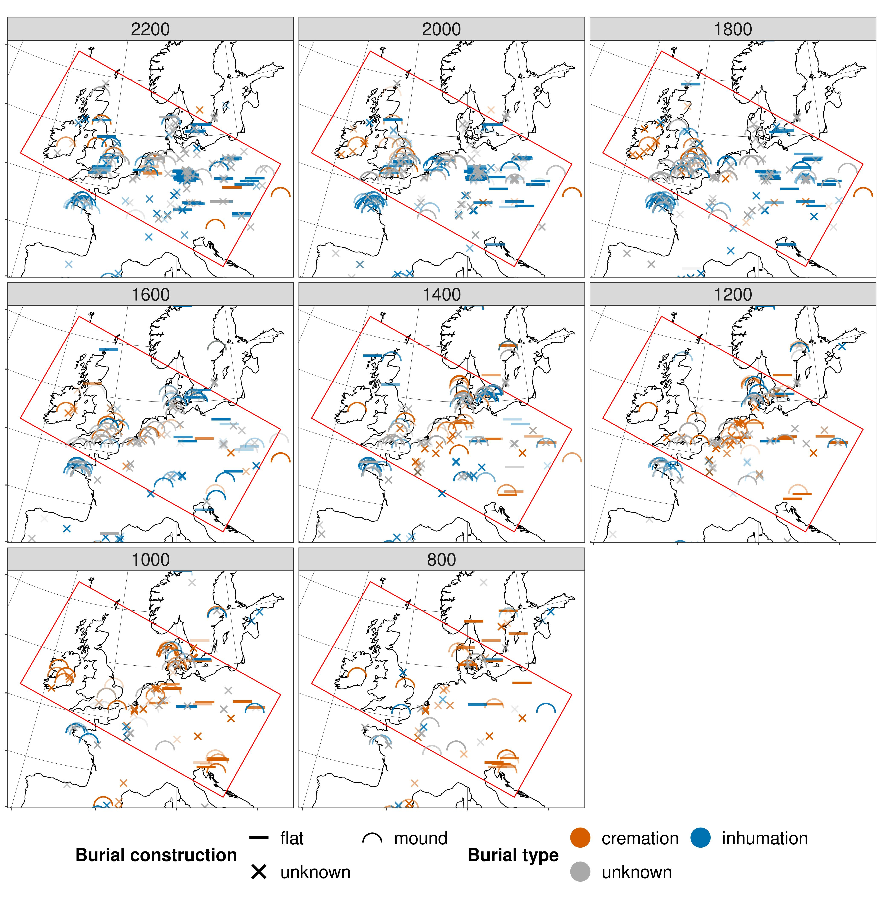
  <figcaption>Timeslices of 200 years in between 2200-800calBC</figcaption>
</figure>

## Artificial comparison regions based on a regular grid 

<figure>
  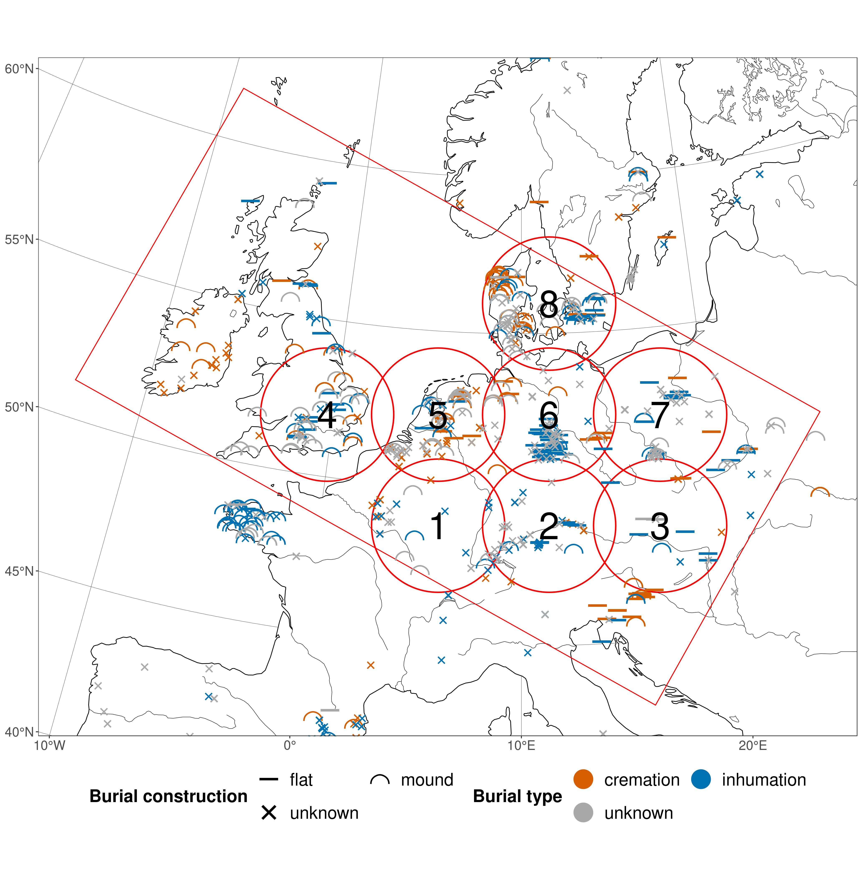
  <figcaption>Grid point distance: 400km, Circle radius: 240km, only regions with >=70 graves were kept</figcaption>
</figure>

## Spatio-temporal development (amount of graves)

<div id="left">
  <figure>
    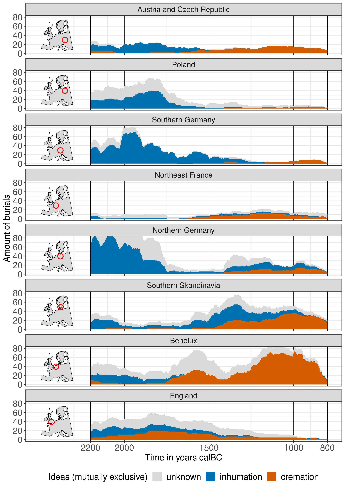
    <figcaption>Grave counted as present if year within ^14^C 2σ range</figcaption>
  </figure>
</div>
<div id="right">
  <figure>
    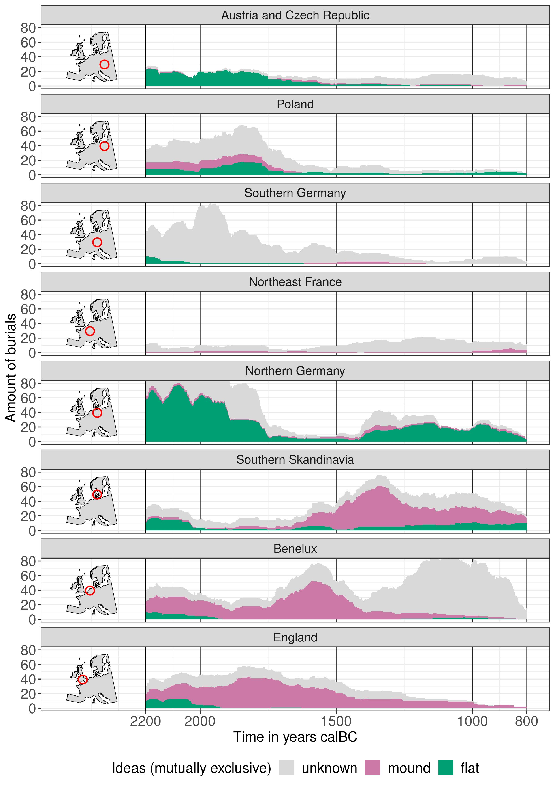
  </figure>
</div>

## Spatio-temporal development (proportion of ideas)

<div id="left">
  <figure>
    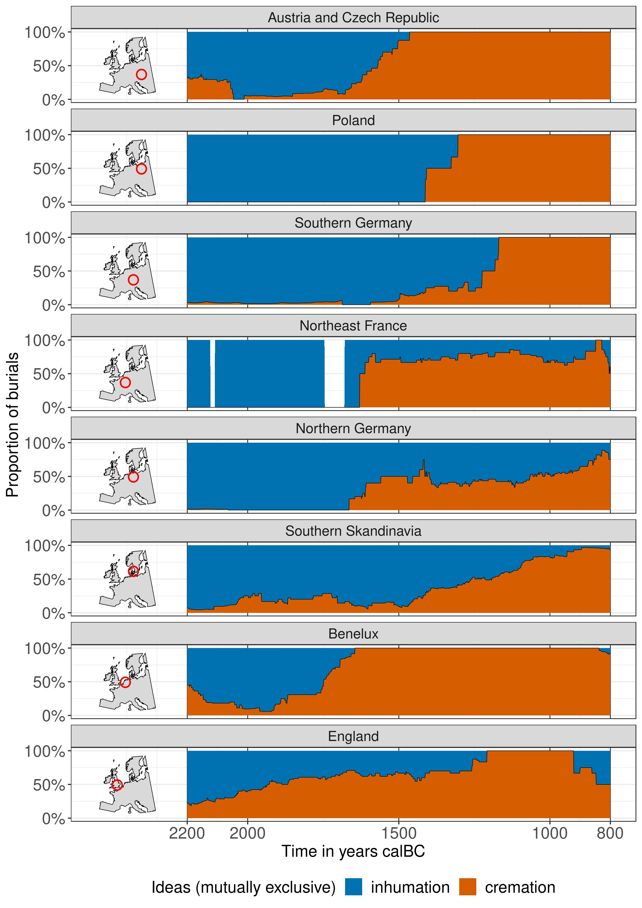
    <figcaption>The category "unknown" was ignored for the proportion calculation</figcaption>
  </figure>
</div>
<div id="right">
  <figure>
    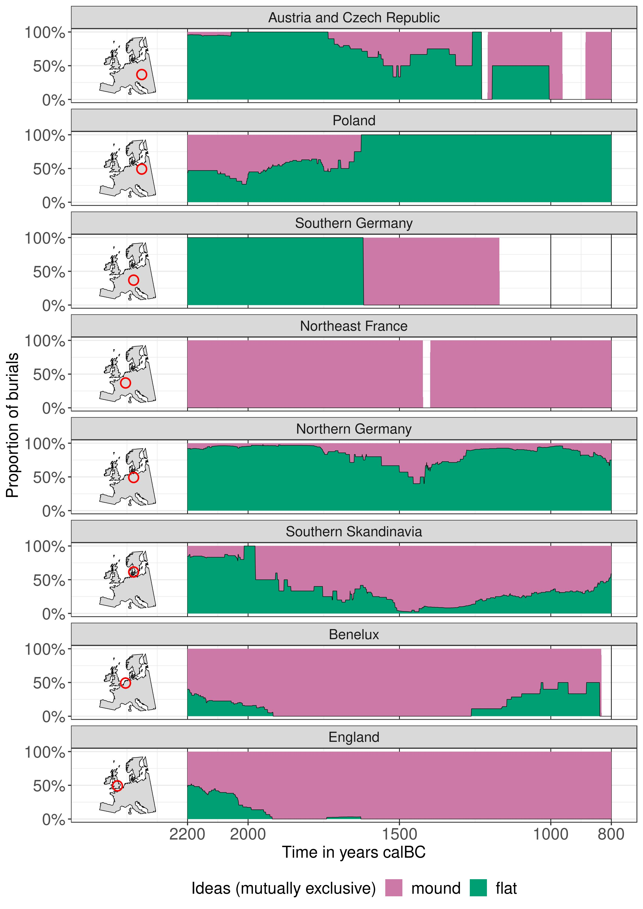
  </figure>
</div>

## Closer look: Southwestern Germany

Falkenstein, F. (2017). Zum Wandel der Bestattungssitten von der Hügelgräber- zur Urnenfelderkultur in Süddeutschland. In D. Brandherm & B. Nessel (Eds.), Phasenübergänge und Umbrüche im bronzezeitlichen Europa (pp. 77–96). Bonn.

<figure>
  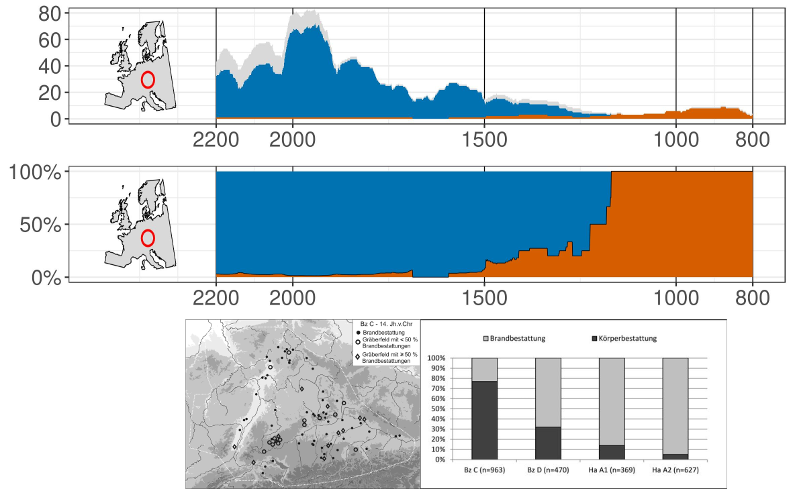
</figure>

## Closer look: Southwestern Germany

Falkenstein, F. (2017). Zum Wandel der Bestattungssitten von der Hügelgräber- zur Urnenfelderkultur in Süddeutschland. In D. Brandherm & B. Nessel (Eds.), Phasenübergänge und Umbrüche im bronzezeitlichen Europa (pp. 77–96). Bonn.

<figure>
  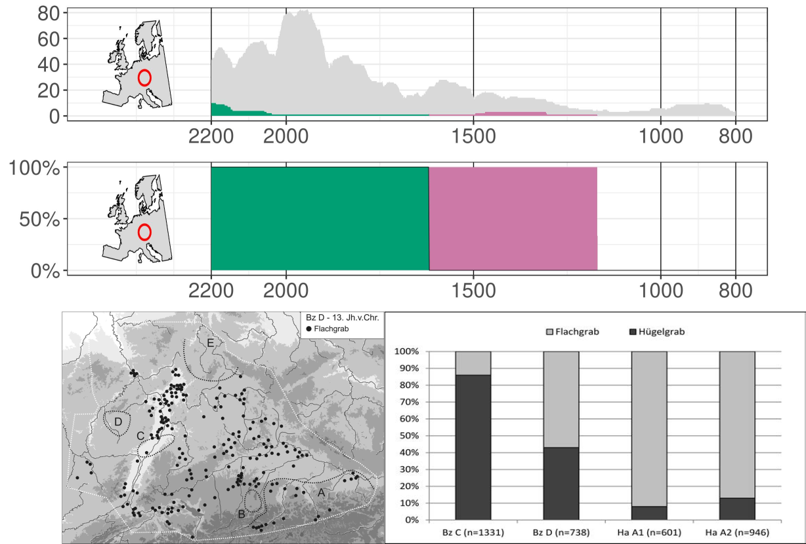
</figure>

## 

\
\
\

<font size="20">**Theory**</font>

<hr>

## Theoretical basis: Evolutionary Archaeology

**Cultural evolution theory**: 
The processes of natural development of species through evolution also affect human cultural development.

\

<div class="fragment" data-fragment-index="1">
- **Evolutionism** (und Social Darwinism) -- Cultural Relativism -- **Neoevolutionism** & Multilineal evolution
</div>

\

<div class="fragment" data-fragment-index="2">
- New Perspectives from the 1970s:
    - **Evolutionary psychology**
    - **Human behavioural ecology**
    - **Dual inheritance theory**: Culture forms a second, much more dynamic hereditary system that leaves genetically determined behaviour behind.
</div>

## Burial rites as Neutral Variants

- Funeral rituals are **behaviour/ideas/cultural traits/memes** and spread in space and time. They life in **social space** and their spread depends on social relationships.

<div class="fragment" data-fragment-index="1">
- Funeral rituals are a **special category** of ideas: They have a **relatively low interaction** with the **human-environment system**: they can be treated as **selectively neutral**.
</div>

<div class="fragment" data-fragment-index="2">
Dunnell, R. C. (1978). Style and Function: A Fundamental Dichotomy. American Antiquity, 43(2), 192–202. https://doi.org/10.2307/279244

_**Style** denotes those forms that do not have detectable selective values. **Function** is manifest as those forms that directly affect the Darwinian fitness of the populations in which they occur._
</div>

<div class="fragment" data-fragment-index="3">
_Traits that have discrete selective values over measurable amounts of time should be accountable by natural selection and a set of external conditions. **Traits identified as adaptively neutral will display a very different kind of behavior** because their frequencies in a population are not directly accountable in terms of selection and external contingencies. Their behavior should be more adequately accommodated by **stochastic processes**_
</div>

## Simulating Transmission of Neutral Variants

- The main mechanisms of diffusion of neutral variants are **drift** and **flow**.

<div class="fragment" data-fragment-index="1">
A **simple simulation** to illustrate these processes:

Neiman, F. D. (1995). Stylistic Variation in Evolutionary Perspective: Inferences from Decorative Diversity and Interassemblage Distance in Illinois Woodland Ceramic Assemblages. American Antiquity, 60(1), 7–36. https://doi.org/10.2307/282074

https://nevrome.shinyapps.io/neiman1995/
</div>

<div class="fragment" data-fragment-index="2">
**Ingredients:**

- A population of individuals with size $N$
- $k$ different neutral variants in this population
- In each time step every individual randomly adopts a variant from somebody else.
</div>

## Temporal dynamics of drift

```{r}
system("xfce4-terminal -e \"bash -c \\\"R -e 'getwd(); shiny::runApp(deparse(substitute(shiny_neiman_1.R)), port = 3539)'; bash\\\"\" -T \"Run and ready\"", wait = F)
```

<iframe src="http://127.0.0.1:3539" style="width: 8000px; height: 650px"></iframe>

- $k$: Amount of variants in a population
- $N_e$: Size of the effective population
- $t$: Time / number of iterations
- ($μ$: Innovation rate. Probability of the creation of a new variant)

## Temporal dynamics of drift and flow

```{r}
system("xfce4-terminal -e \"bash -c \\\"R -e 'getwd(); shiny::runApp(deparse(substitute(shiny_neiman_3.R)), port = 3541)'; bash\\\"\" -T \"Run and ready\"", wait = F)
```

<iframe src="http://127.0.0.1:3541" style="width: 8000px; height: 650px"></iframe>

- $k$: Amount of variants in a population
- $N_e$: Size of the effective population
- $t$: Time / number of iterations
- $m_i$: Intergroup transmission rate
- $d_{ij}^2$: Squared Euclidean distance

## 

\
\
\

<font size="20">**Model & Simulation**</font>

<hr>

## Idea

If there's a relation of population size, intergroup interaction and intergroup homogeneity, is it possible to get better insights into population level parameters with a transmission model that describes population in more sophisticated terms? 

⇒ Implementation of a **computer model** in R and C++ to simulate the **transmission** of a **special idea category** in comparison to **archaeological data**.

**Ingredients:**

- Diachronic **population graph**
    - Individuals
    - Relations
- Entities: **ideas** (*the meme's eye view*)
- Behaviour: **Reproduction** through expansion 

## Population graph -- Concept

<figure>
  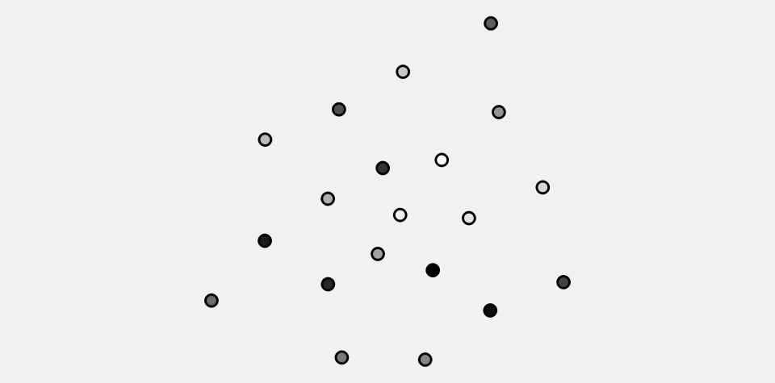
  <figcaption>Population graph, no connection</figcaption>
</figure>

## Population graph -- Concept

<figure>
  
  <figcaption>Population graph, couples (special horizontal relationship)</figcaption>
</figure>

## Population graph -- Concept

<figure>
  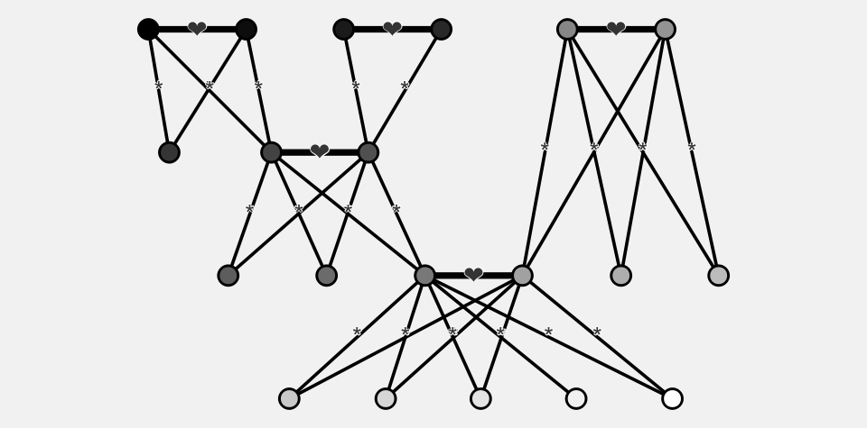
  <figcaption>Population graph, vertical relations</figcaption>
</figure>

## Population graph -- Concept

<figure>
  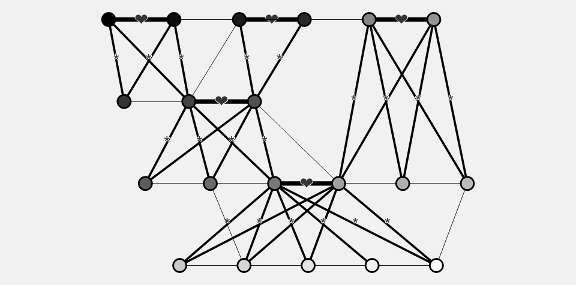
  <figcaption>Population graph, horizontal and oblique relations</figcaption>
</figure>

## Population graph -- Actual implementation

```{r eval = FALSE, echo = TRUE}

# create models_grid data.frame
models_grid <- expand.grid(
  # general settings
  timeframe = list(
    0:1400
  ),
  # population settings  
  population_size_functions = c(
    function(t) {40}
    # function(t) {round(0.0002 * (t - 700)^2 + 10, 0)}
  ),
  units_amount = c(
    8
  ),
  age_distribution_functions = c(
    function(x) {1 / (1 + 0.0004 * 0.7^(-7*log(x)))}
  ),
  age_ranges = list(
    1:100
  ),
  # relations settings
  amounts_friends = list(
    20
  ),
  unit_interaction_matrix = list(
    t(matrix(
      c(
        0,1,1,1,1,1,1,1,
        1,0,1,1,1,1,1,1,
        1,1,0,1,1,1,1,1,
        1,1,1,0,1,1,1,1,
        1,1,1,1,0,1,1,1,
        1,1,1,1,1,0,1,1,
        1,1,1,1,1,1,0,1,
        1,1,1,1,1,1,1,0
      ),
      8, 8
    ))
  ),
  cross_unit_proportion_child_of = list(
    0
  ),
  cross_unit_proportion_friend = list(
    0,
    0.01,
    0.10
  ),
  weight_child_of = list(
    5
  ),
  weight_friend = list(
    3
  ),
  # ideas settings
  names = list(
    c("idea_1", "idea_2")
  ),
  start_distribution = list(
    start_proportion_burial_type
  ), 
  strength = list(
    c(1, 1) 
  )
) %>% tibble::as.tibble() %>%
  dplyr::mutate(
    multiplier = 1:nrow(.)
  ) %>%
  tidyr::uncount(1) %>%
  dplyr::mutate(
    model_id = 1:nrow(.)
  )

```

## Population graph  -- Actual implementation

<figure>
  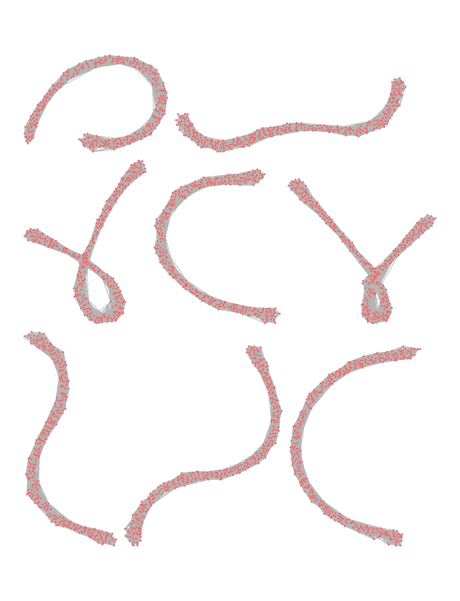
  <figcaption>Constant population size of 40, 1400 years, Cross unit horizontal contact proportion: 0</figcaption>
</figure>


## Population graph -- Actual implementation

<figure>
  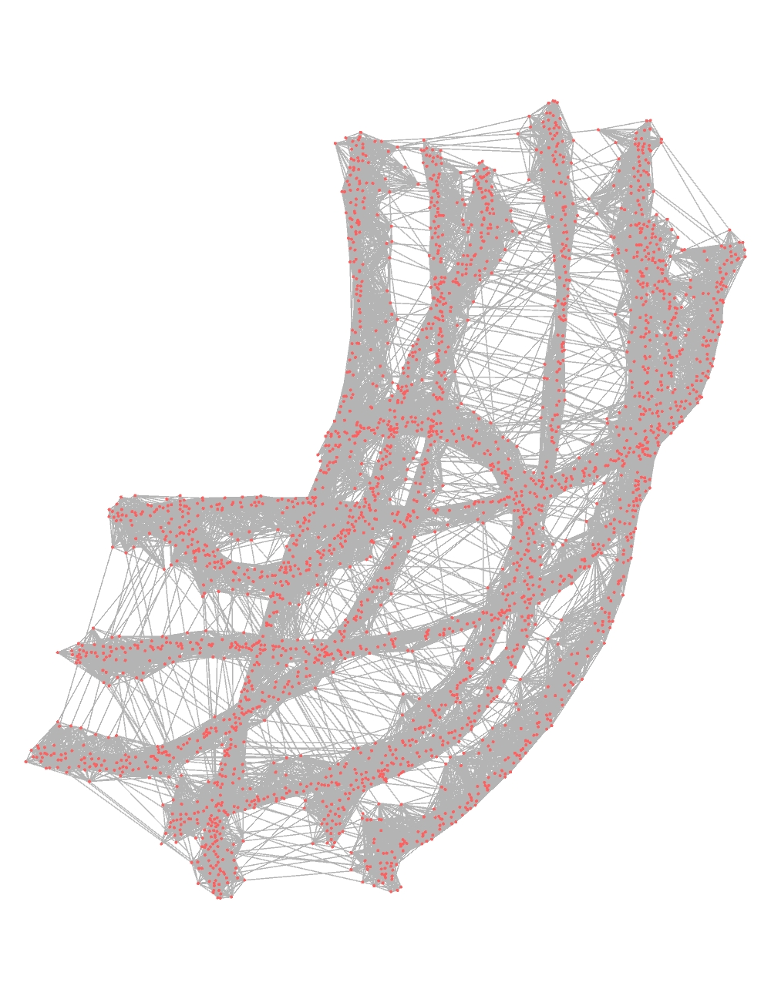
  <figcaption>Constant population size of 40, 1400 years, Cross unit horizontal contact proportion: 0.01</figcaption>
</figure>


## Population graph -- Actual implementation

<figure>
  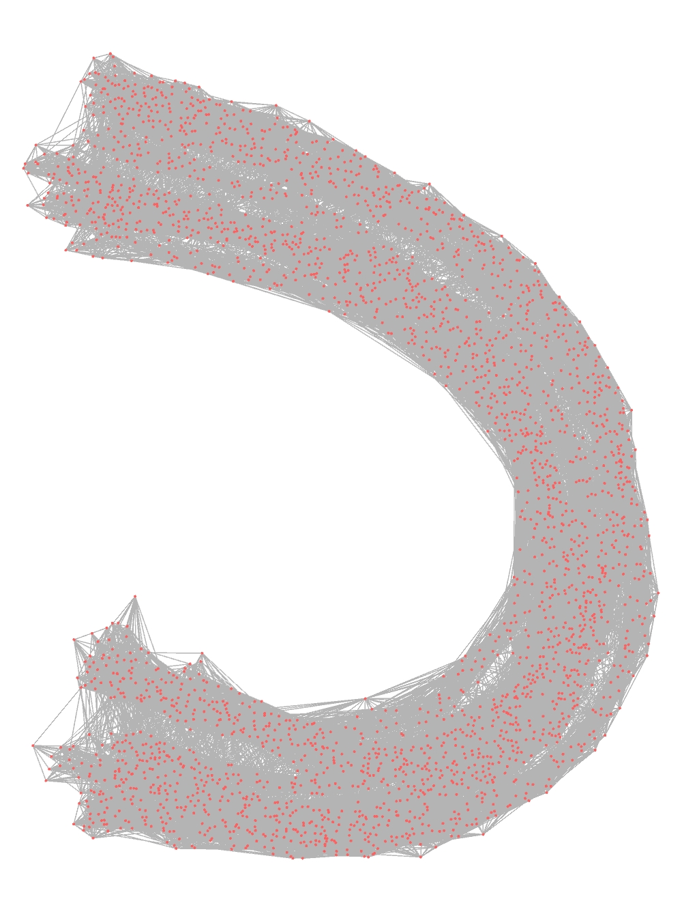
  <figcaption>Constant population size of 40, 1400 years, Cross unit horizontal contact proportion: 0.1</figcaption>
</figure>

## Idea behaviour -- Concept

<figure>
  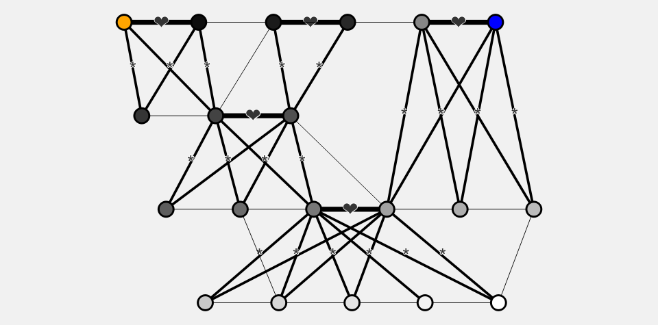
  <figcaption>Idea expansion 1</figcaption>
</figure>

## Idea behaviour -- Concept

<figure>
  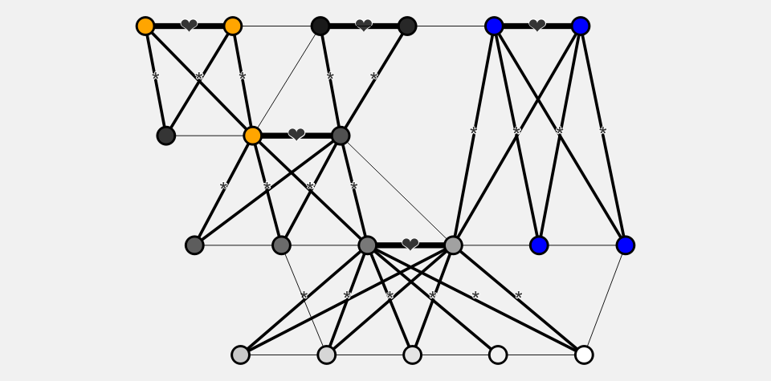
  <figcaption>Idea expansion 2</figcaption>
</figure>

## Idea behaviour -- Concept

<figure>
  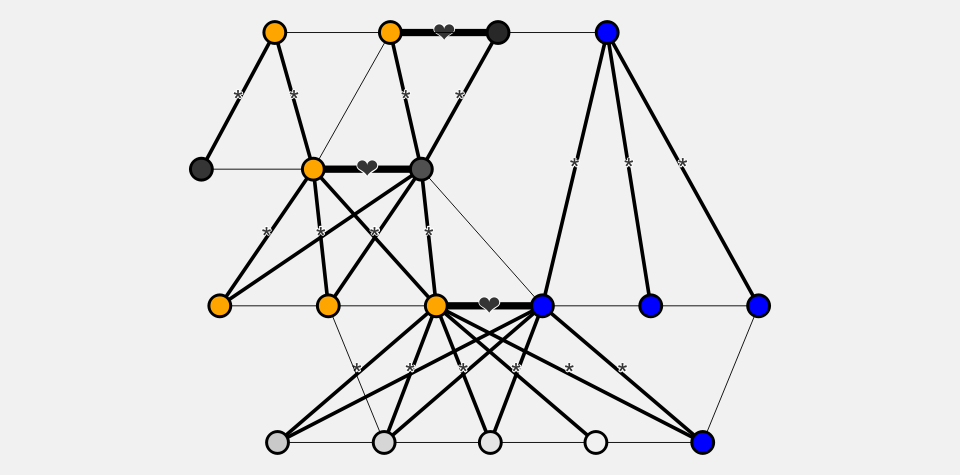
  <figcaption>Idea expansion 3</figcaption>
</figure>

## Idea behaviour -- Concept

<figure>
  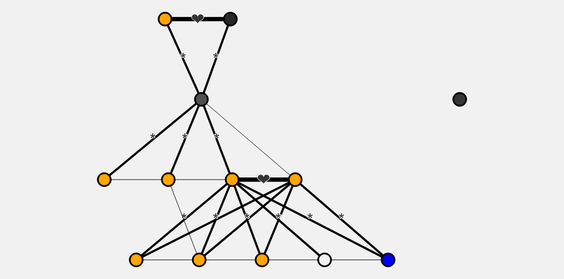
  <figcaption>Idea expansion 4</figcaption>
</figure>

## Idea behaviour -- Concept

<figure>
  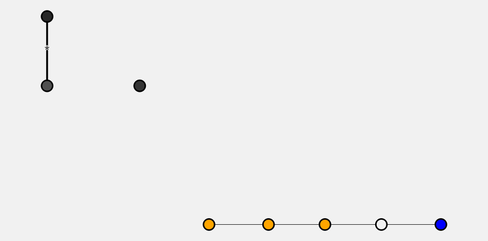
  <figcaption>Idea expansion 5</figcaption>
</figure>

## Idea behaviour -- Concept

<figure>
  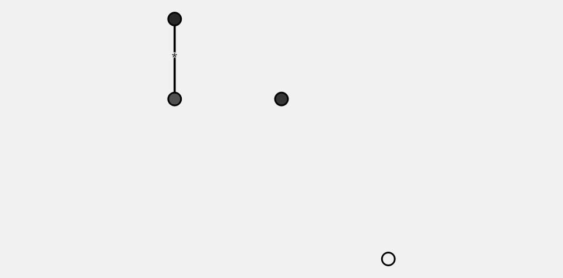
  <figcaption>Idea expansion 6</figcaption>
</figure>

## Idea behaviour -- Actual implementation

```{cpp eval = FALSE, echo = TRUE}
void Idea::expand() {
  
  // get all neighboring nodes
  std::vector<int> all_neighbors = this->get_all_neighboring_nodes();
  // remove duplicates from neighbors
  std::vector<int> neighbors_without_doubles = remove_duplicates(all_neighbors);
  // remove the current nodes from neighbors
  std::vector<int> neighbors = erase_elements_of_second_vector_from_the_first(
    neighbors_without_doubles, this->current_nodes
  );
  
  // make decision: which neighbors can be converted
  std::vector<int> converted = this->select_nodes_to_convert(neighbors);
  
  // delete current nodes from graph
  for (auto& i : this->current_nodes) {
    if(this->realworld->does_node_exist(i)) {
      this->realworld->delete_nodes(i);
      this->dead_nodes.push_back(i);
    }
  }
  
  // forget current nodes and make neighbors new current nodes
  this->current_nodes.clear();
  this->current_nodes.insert(
    this->current_nodes.end(), converted.begin(), converted.end()
  );
  
}
```

## Very first results

<figure>
  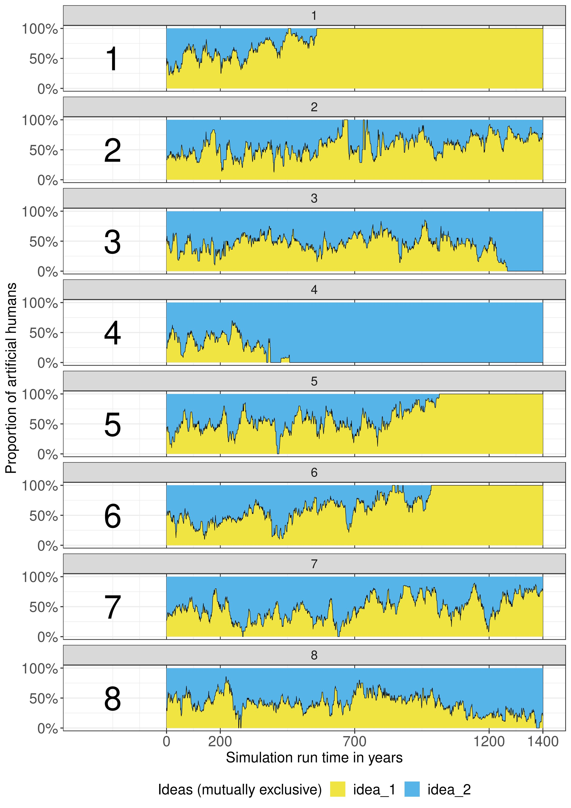
</figure>


## Very first results

<figure>
  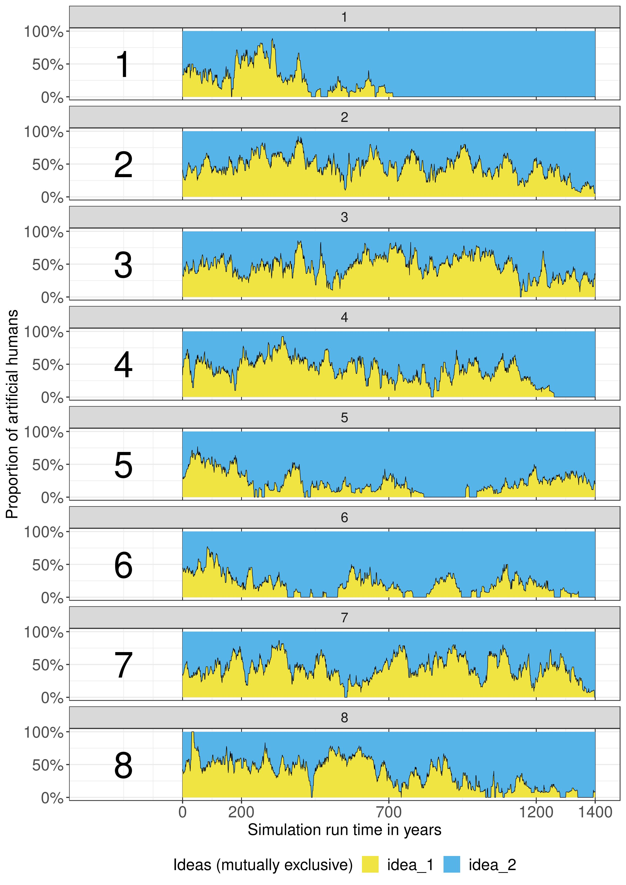
</figure>


## Very first results

<figure>
  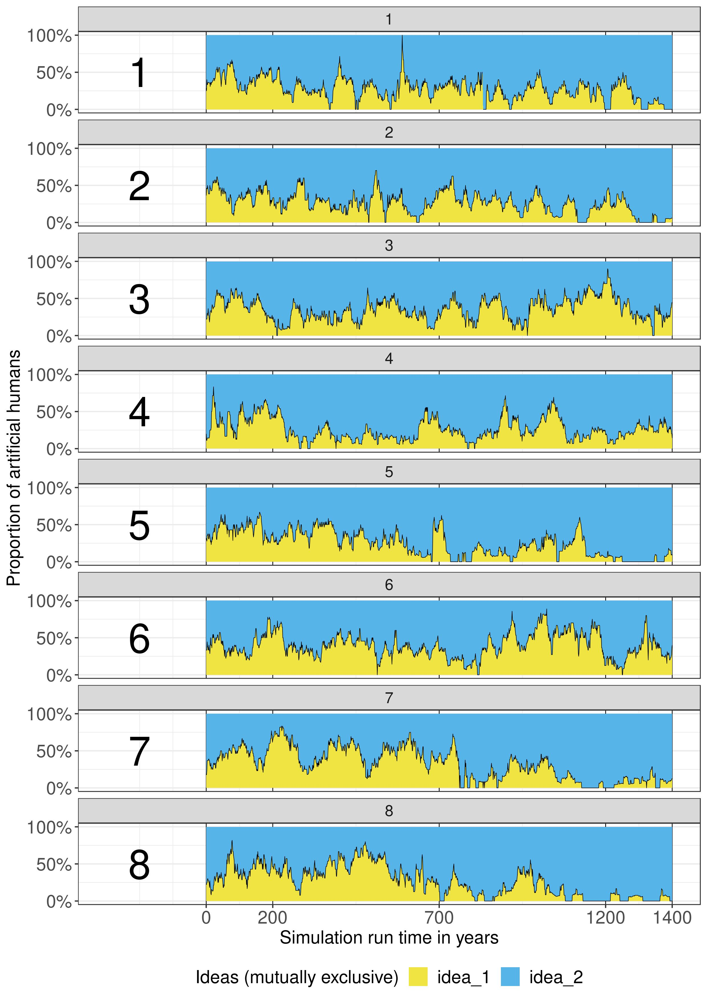
</figure>


## 

\
\
\

<font size="20">**ToDo**</font>

<hr>

## ToDo

- Simulation
  - Development of better methods and visualizations for simulation result comparison
  - Systematic exploration of the model parameters and their consequences

<div class="fragment" data-fragment-index="1">
- Theory
  - Analysis of the special characteristics of death related cultural traits
</div>  

<div class="fragment" data-fragment-index="2">
- Real world data
  - Integroup time series comparison to establish an inductive measurand for intergroup connectedness
  - Brief but systematic estimation of sample representativeness
</div>  

