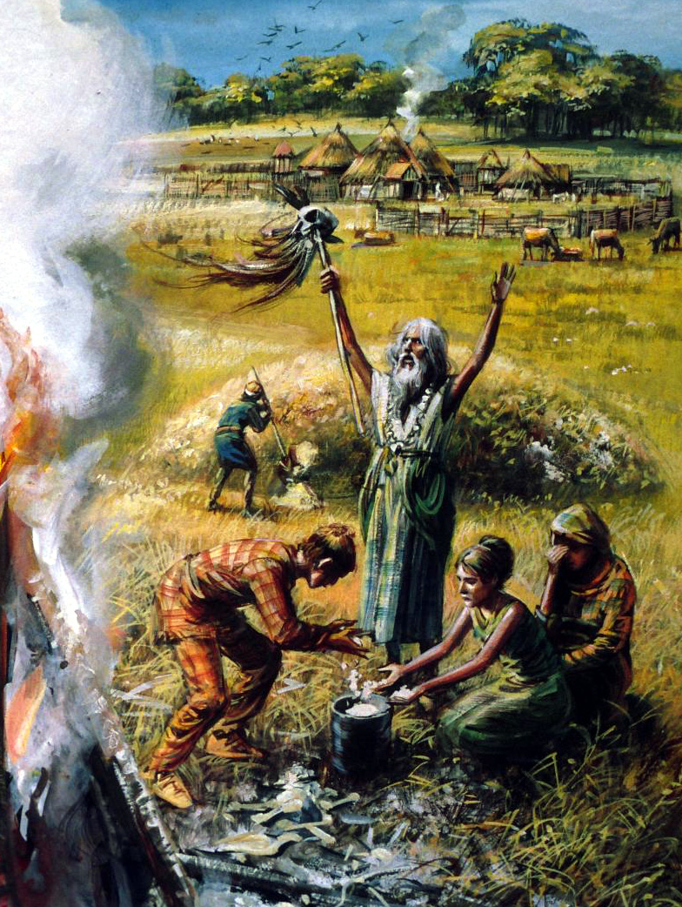

```{r setup, include=FALSE}
knitr::opts_chunk$set(echo = FALSE)
```

```{r, echo=FALSE}
library(visNetwork)
```

## Konzeptpräsentation 

<div id="left">
  <font size="10">**Bronzezeit, Bestattungen & Cultural Evolution**</font>

  Clemens Schmid \
  *28. Februar 2018*
</div>

<div id="right">
  <figure>
    
    <figcaption>© Mike Codd, hampshirearchaeology.wordpress.com [13.02.18]</figcaption>
  </figure>
</div>

## Bestattungsbräuche der europäischen Bronzezeit

- Gräber und Gräberfelder sind eine wesentliche Kategorie der Bronzezeitforschung

\

<div class="fragment" data-fragment-index="2">
- räumliche und zeitliche **Heterogenität der Phänomene**
     - Grabanlage- und Vergesellschaftung (Nachnutzung neolithischer Megalithik, Gräberfelder, etc.) 
     - Grabbau (Särge, Totenhäuser, Bootsgräber, etc.)
     - Beigabenauswahl 
     - Platzierung des Leichnams
     - ...
</div>

\

<div class="fragment" data-fragment-index="3">
- **Hauptspannungsfelder**
    - Körperbestattung vs. Brandbestattung
    - Flachgrab vs. Hügelgrab
</div>
    
## Klassisches Narrativ der Entwicklung bronzezeitlicher Bestattungssitten

<div class="fragment" data-fragment-index="1">
**Frühe und Mittlere Bronzezeit**

- Körperbestattungen (in verschiedenen Variationen)
- Brandgräber dominieren zunächst nur in der Ungarischen Tiefebene
</div>
<div class="fragment" data-fragment-index="2">
- Hügelgräber in Ost-, West- und Nordeuropa
- Flachgräber in Zentral- und Südeuropa, Überhügelung gewinnt langsam an Bedeutung 
</div>

\

<div class="fragment" data-fragment-index="3">
**Späte Bronzezeit**

- Brandbestattung setzt sich (fast) überall durch: *Urnenfelderzeit*
</div>

## Quantitative Erfassung der Phänomene: RADON-B

<figure>
  
</figure>

<div class="fragment" data-fragment-index="1">
<sup>14</sup>C-Daten mit Kontextinformationen

- **3059** Daten an Gräbern aus einem Zeitfenster 2500 -- 500 calBC
- Metainformationen
     - 1792 Daten daraus mit einer Angabe zu Körpergrab/Brandgrab (1153/639)
     - 1091 Daten daraus mit einer Angabe zu Flachgrab/Hügelgrab (585/506)
     - 901 Daten mit Angaben zu beiden Kontexten
</div>

## 

<section data-background-video="./the_movie_3.mp4" 
              data-background-color="#f1f1f1">
</section>

## Räumliche Gliederung und zeitliche Entwicklung

<figure>
  
  <figcaption>Abtrennung räumlicher Einheiten nach J. Kneisel und O. Nakoinz</figcaption>
</figure>


## Räumliche Gliederung und zeitliche Entwicklung

<div id="left">
  <figure>
    
  </figure>
</div>
<div id="right">
  <figure>
    
  </figure>
</div>

## Räumliche Gliederung und zeitliche Entwicklung

<div id="left">
  <figure>
    
  </figure>
</div>
<div id="right">
  <figure>
    
  </figure>
</div>

## Theoretische Grundlage: Evolutionary Archaeology

**Cultural evolution theory**: 
Die Prozesse der natürlichen Entwicklung von Spezies durch Evolution wirken auch bei der menschlichen Kulturentwicklung.

\

<div class="fragment" data-fragment-index="1">
- **Evolutionismus** (und Sozialdarwinismus) -- Kulturrelativismus -- **Neoevolutionismus** & Multilineare Evolution
</div>

\

<div class="fragment" data-fragment-index="2">
- Neue Perspektiven ab den 1970ern
    - **Evolutionary psychology**
    - **Human behavioural ecology**
    - **Dual inheritance theory**: Kultur bildet ein zweites, viel dynamischeres Vererbungssystem, das genetisch determiniertes Verhalten hinter sich lässt.
</div>

## Cultural Transmission and Evolution

- Bestattungsrituale sind **Verhalten/Ideen/Cultural Traits/Meme** und breiten sich in **Raum und Zeit** aus.

<div class="fragment" data-fragment-index="1">
- Bestattungsrituale sind eine **besondere Kategorie** von Ideen: Sie haben eine **relativ geringe Wechselwirkung** mit dem **Mensch-Umwelt-System**.
</div>

<div class="fragment" data-fragment-index="2">
- Stattdessen leben Bestattungsrituale vor allem im **sozialen Raum** und ihre Ausbreitung ist von sozialen Beziehungen abhängig. 
</div>


\

<div class="fragment" data-fragment-index="3">
- Abbildung in einem abstrakten Modell
    - Landschaft: **Diachroner Populationsgraph** aus einem Populationsgenerator
    - Entitäten: Ideen (**the meme's eye view**)
    - Verhalten: **Reproduktion** durch Expansion (und Kooperation?)
</div>

## Populationsgraph: Individuen

```{r, out.width = '100%', fig.height = 7}
palette <- colorRampPalette(colors=c("#000000", "#FFFFFF"))

nodes0 <- tibble::tibble(
  id = 1:20, 
  color.background = palette(length(id)),
  color.border = "black",
  label = id,
  borderWidth = 3,
  shape = "circle",
  level = c(1,1,1,1,2,2,2,3,3,3,1,1,3,3,3,4,4,4,4,4)
)
edges0 <- tibble::tibble()

visNetwork(nodes0, edges0) %>%
  visLayout(randomSeed = 23)
```

## Populationsgraph: Reproduktion

```{r, out.width = '100%', fig.height = 7}
edges1 <- tibble::tibble(
  from = c(1, 3, 6, 11, 10),
  to =   c(2, 4, 7, 12, 13),
  label = "❤",
  font.size = 30,
  width = 8
)

visNetwork(nodes0, edges1) %>%
  visLayout(randomSeed = 23)
```

## Populationsgraph: Vertikale Beziehungen

```{r, out.width = '100%', fig.height = 7}
edges2 <- edges1 %>% rbind(
  tibble::tibble(
    from = c(1,2,1,2 , 3,4, 6,7,6,7, 6, 7, 11,12,11,12,11,12, 10,13,10,13,10,13, 10, 10,13),
    to =   c(5,5,6,6 , 7,7, 8,8,9,9,10,10, 13,13,14,14,15,15, 16,16,17,17,18,18, 19, 20,20),
    label = "*",
    font.size = c(30),
    width = 4
  )
)

visNetwork(nodes0, edges2) %>%
  visHierarchicalLayout() 
```

## Populationsgraph: Vererbung 

```{r, out.width = '100%', fig.height = 7}
nodes1 <- nodes0
nodes1$color.background[c(4, 7, 9, 10, 17, 19)] = "orange"

visNetwork(nodes1, edges2) %>%
  visHierarchicalLayout() 
```

## Populationsgraph: Horizontale Beziehungen

```{r}
expand.grid.unique <- function(x, y, include.equals=FALSE) {
  x <- unique(x)
  y <- unique(y)
  g <- function(i) {
    z <- setdiff(y, x[seq_len(i-include.equals)])
    if(length(z)) cbind(x[i], z, deparse.level=0)
  }
  do.call(rbind, lapply(seq_along(x), g)) %>%
    as.data.frame() %>%
    return()
}
```

```{r, out.width = '100%', fig.height = 7}
all_relations <- expand.grid(nodes0$id, nodes0$id) %>%
  dplyr::rename(
    from = Var1,
    to = Var2
  ) %>% dplyr::filter(
    from != to
  )

additional_relations <- all_relations %>% 
  dplyr::anti_join(
    edges2,
    by = c("from", "to")
  ) %>%
  dplyr::anti_join(
    edges2 %>% dplyr::rename(to = from, from = to),
    by = c("from", "to")
  ) %>%
  dplyr::mutate(
    label = NA,
    font.size = 30,
    width = 1
  )

edges3 <- edges2 %>% rbind(additional_relations)

edges3 %>%
 igraph::graph_from_data_frame(d = ., vertices = nodes0, directed = FALSE) %>%
  visNetwork::visIgraph(layout = "layout_in_circle", idToLabel = FALSE)
```

## Populationsgraph: Horizontale Beziehungen

```{r out.width = '100%', fig.height = 7}
# set.seed(123)
# additional_relations_small <- dplyr::sample_n(additional_relations, 30)
additional_relations_small <- tibble::tibble(
  from = c(2,  3, 5, 8,  9, 13, 14, 16, 17, 18, 19),
  to =   c(3, 11, 6, 9, 10, 14, 15, 17, 18, 19, 20),
  label = NA,
  font.size = 30,
  width = 1
)

edges4 <- edges2 %>% rbind(additional_relations_small)

visNetwork(nodes0, edges4) %>%
  visHierarchicalLayout() 
```

## Populationsgraph: Vererbung und Transmission

```{r out.width = '100%', fig.height = 7}
nodes2 <- nodes0
nodes2$color.background[c(4, 11, 12, 13, 14, 7, 6, 8, 9, 10, 16, 17, 18, 19)] <- "orange"

visNetwork(nodes2, edges4) %>%
  visHierarchicalLayout() 
```

## Methode und Fragen

Implementierung eines **Computermodells** in R und C++ zur Simulation der **Transmission** einer **besonderen Ideenkategorie** in Abgleich zu **archäologischen Daten**.

<div class="fragment" data-fragment-index="2">
- Mit welcher **Geschwindigkeit** breitet sich diese Ideenkategorie bei verschiedenen **Populationsparametern** aus?
- Über welche **Ausbreitungsmodi** und Kanäle verbreitet sich diese Ideenkategorie primär?
- Welche Rolle spielen die klassischen Axiome der **Diffusion of Innovation** Forschung (z.B. Tradition vs. Innovation, Early Adopters vs. Laggards) für sehr stabile Ideen über lange Zeiträume?
</div>

<div class="fragment" data-fragment-index="3">
- Erklären **diachrone Veränderungen der Populationsparameter** Ablöseereignisse (z.B. Bottlenecks)?
- Ist die räumlich-zeitliche **Korrelation verschiedener Ideen** Ausdruck kausaler Beziehungen oder Nebeneffekt von Transmissionsstrukturen?
</div>

